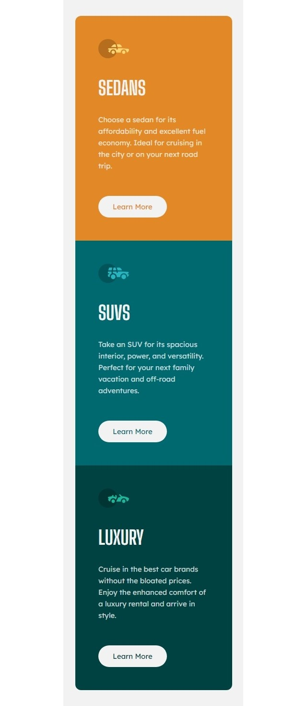
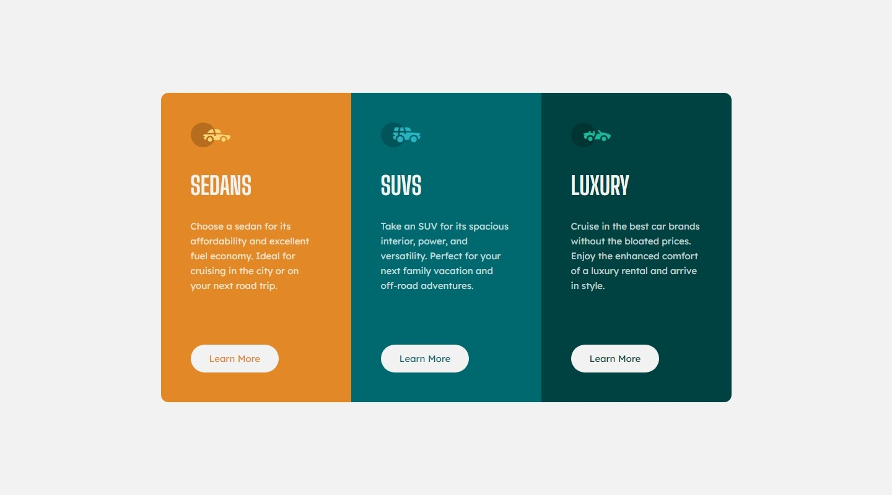

# Frontend Mentor - 3-column preview card component solution

This is a solution to the [3-column preview card component challenge on Frontend Mentor](https://www.frontendmentor.io/challenges/3column-preview-card-component-pH92eAR2-). Frontend Mentor challenges help you improve your coding skills by building realistic projects.

## Table of contents

- [Overview](#overview)
  - [The challenge](#the-challenge)
  - [Screenshot](#screenshot)
  - [Links](#links)
- [My process](#my-process)
  - [Built with](#built-with)
  - [What I learned](#what-i-learned)
  - [Continued development](#continued-development)
  - [Useful resources](#useful-resources)
- [Author](#author)
- [Acknowledgments](#acknowledgments)

## Overview

### The challenge

Users should be able to:

- View the optimal layout depending on their device's screen size
- See hover states for interactive elements

### Screenshot




### Links

- Solution URL: [Solution on GitHub](https://github.com/horoserp/column-card)
- Live Site URL: [Live Site](https://horoserp.github.io/column-card)

## My process

### Built with

- Semantic HTML5 markup
- CSS custom properties
- Flexbox

### What I learned

I learned more about responsiveness across devices and the CSS property:value pair "margin-bottom: auto". Additionally, I was able to refresh my memory on the difference between HTML anchor and button tags. Finally, I learned a neat shortcut for Windows to copy text from an image (Windows-Shift-T).

```html
<div class="button">
  <a href="#">Learn More</a>
</div>
```

```css
.category:first-child {
  background-color: var(--Bright-orange);
  border-top-left-radius: 12px;
  border-bottom-left-radius: 12px;
}
```

### Continued development

I would like to explore ways to make the button text transparent and also have the background JUST under that text transparent as well.

### Useful resources

- [W3Schools](https://www.w3schools.com/) - This is a great reference site which helped me remember some of the required syntax.
- [Stack Overflow](https://stackoverflow.com/) - This is an excellent resource for finding answers to precise questions.

## Author

- Website - [Robert P. Horosewski](https://horoserp.github.io/React-Portfolio)
- Frontend Mentor - [@horoserp](https://www.frontendmentor.io/profile/horoserp)
- LinkedIn - [Robert P. Horosewski](https://www.linkedin.com/in/robert-horosewski-8a0608196/)

## Acknowledgments

Thanks to my wife for the encouragement to pursue my dream.
